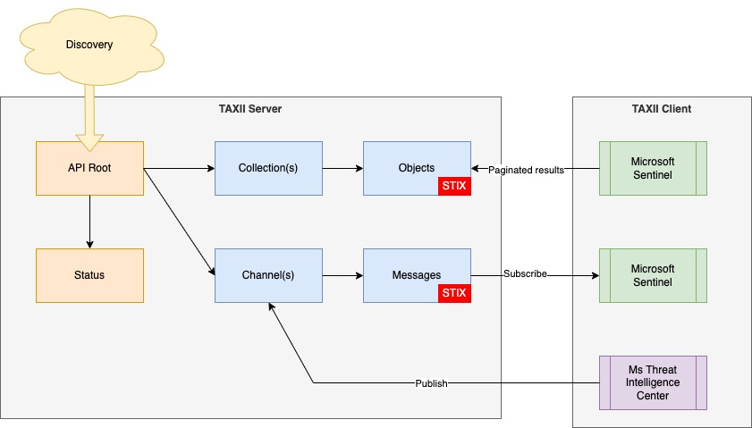

# STIX-TAXII in Microsoft's Unified SecOps Platform

🔥 This is our second part in the series on using STIX in Microsoft's Unified SecOps Platform, where we guide you through basic topics in short digestible posts. This time we'll look at the TAXII portion of the `STIX-TAXII` standard.


This is the second post in this series, we will explain what is TAXII and explain the goals of this implementation standard!


## What is TAXII?

TAXII is an application-layer protocol that serves as a *JSON* based transport mechanism for sharing cyber threat intelligence.

***Below an logical overview of the model:***

TAXII protocol defines a set of specifications for both the `TAXII Server` and `TAXII Client` components. An `TAXII Server` instance provides supporting services and primary sharing capabilities. Supporting services that are provided are:

- **API Root** endpoint which provides a way to create a logical grouping of your sharing types, such as collections and channels.
- **Discovery** helps you to discover newly available collections through *DNS* or a specific endpoint.
- Monitor the actual `TAXII Client` requests through the **Status** endpoint.

Primary sharing capabilities are built up by two sharing models. Currently those models are:
- **TAXII Collection(s)**, which requires you to *Pull* **objects** over HTTP(S), including *optional* pagination.
- **TAXII Channel(s)**, requires you to *Publish or Subscribe to* **messages**, which provides an *event-driven* approach of exchanging TI data through *Push* messages.

Last part to look into is the `TAXII Client`. `TAXII Client` capabilities differ per sharing model. Looking into *collections*, it mainly *pulls* and *ingest* objects from collections into a local SIEM or SOAR such as `Microsoft Sentinel`. For channels it requires a *Pub/Sub* capable `TAXII Client`, for which(at the moment of writing) only a *reference implementation* is available.

 Currently **TAXII version 2.1** is released.

## TAXII?

Abbreviation stands for Trusted Automated eXchange of Intelligence Information. 

## Goals of the TAXII Implementation standard

The main goal of the TAXII protocol is to provide a *simple*, *secure* and *scalable* way of communicating cyber threat intelligence through a set of implementation standards like *RESTful API* definitions.

Consuming *STIX Feeds* using a `TAXII Client` based on the *Collection* sharing model is commonly used practice and already implemented by many security vendors.

On the other hand, we have *channels* which are still in a more *conceptual state*. For the future of Cyber Threat Intelligence it exposes many benefits for *Threat Intelligence Platforms* like improved Performance due *efficient data handling* and greater *Reliability* and *Scalability* due the nature of an *Event-driven Architecture*. This shall enable National CERT's, CSP's or MSSP's to exchange more *TI data* near real-time and increase confidence due the possibilites of improving quality by easier reporting of *Sightings* or new *Observables*. 

### To summarize

We see that *collections* can be seen as API's which requires a more *pull* approach for objects, potentially including pagination while *channels* seem to be more *future proof* by using a event-driven *Pub/Sub* approach, where you only get pushed new or updated messages.

## Vendor Adoption

Vendors that adopted the `STIX-TAXII` standard integrate using the `TAXII Client` component. *SIEM* and *SOAR* vendors like *Microsoft* support consume and ingesting from Threat Intelligence (TI) Feeds. Most consumed TI Feeds contain *IOC's* like *Indicators* of type *ipv4*, *ipv6*, *domain-name* and *url*. As you may expect TI objects defined using *JSON* in STIX format, which is the common sharing model for IOC data.

## Microsoft Defender for Threat Intelligence (MDTI)

Microsoft also provides a *Threat Intelligence solution*, which is part of Microsoft's Unified SecOps Platform. It's TI capabilities are fully integrated with *Microsoft Sentinel*, *Microsoft Security Copilot* and other *Defender* products like *Defender XDR*.  It provides unique capabilities such as *Intel profiles* and *Intel projects* to improve the security posture. You can easily add new *TI Feeds* based on the *TAXII protocol*. 

If you want to use MDTI and have *Microsoft IOC's* included you must have the *Premium* instead of the *Standard* (Free) license. Unfortunately MDTI doesn't yet support creating your own *TAXII Server*. 

## TAXII Servers on the market.

There are many Opensource initiatives, but keep in mind that it's *stable* and based on the *latest release* (TAXII 2.X).
Well-known *Threat Intelligence Platform* (TIP) vendors provide a compatible built-in `TAXII Server`. Example supporting platforms are *OpenCTI*, *MISP* or *EclecticIQ*. 

## Microsoft Security products with TAXII (Client) Support

- [Microsoft Sentinel](https://learn.microsoft.com/en-us/azure/sentinel/)
- [Microsoft Defender](https://learn.microsoft.com/en-us/unified-secops-platform/threat-intelligence-overview/)
- [Microsoft Defender Threat Intelligence](https://learn.microsoft.com/en-us/defender/threat-intelligence/what-is-microsoft-defender-threat-intelligence-defender-ti)

The next post in the series will follow soon! Then we will dive into the `TAXII Implementation`.

Follow me or connect to learn more about STIX-TAXII?

For more great content about Azure Cloud-Native and Cloud Security, follow me or check out my other blogs at [Azure Buddy Online](https://azurebuddy.online).

To support my work, I would be more than grateful if you could repost it. 😊
