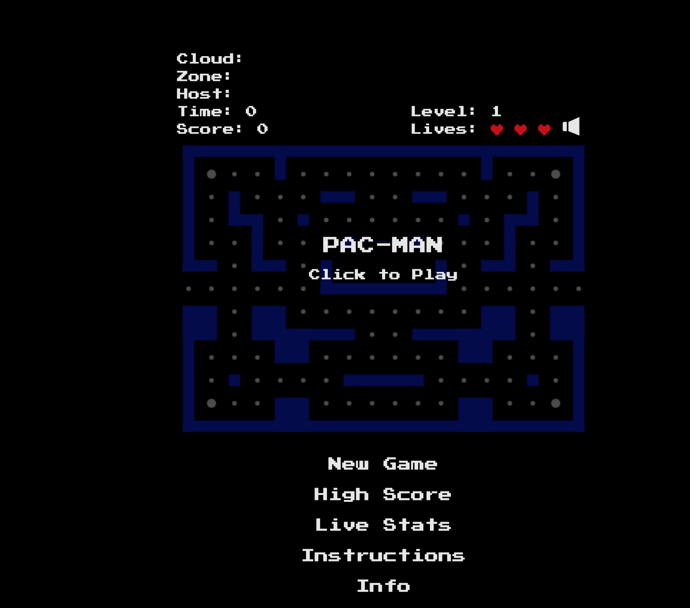
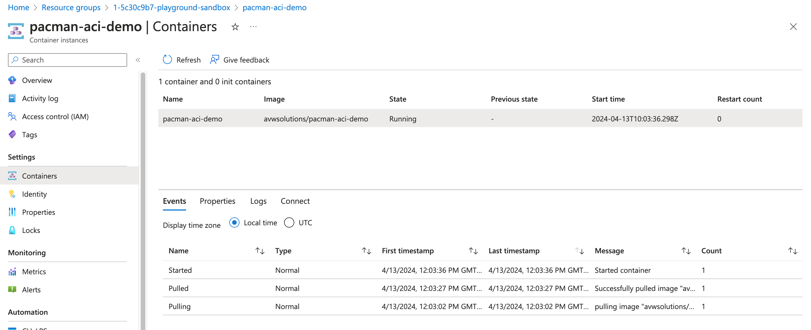
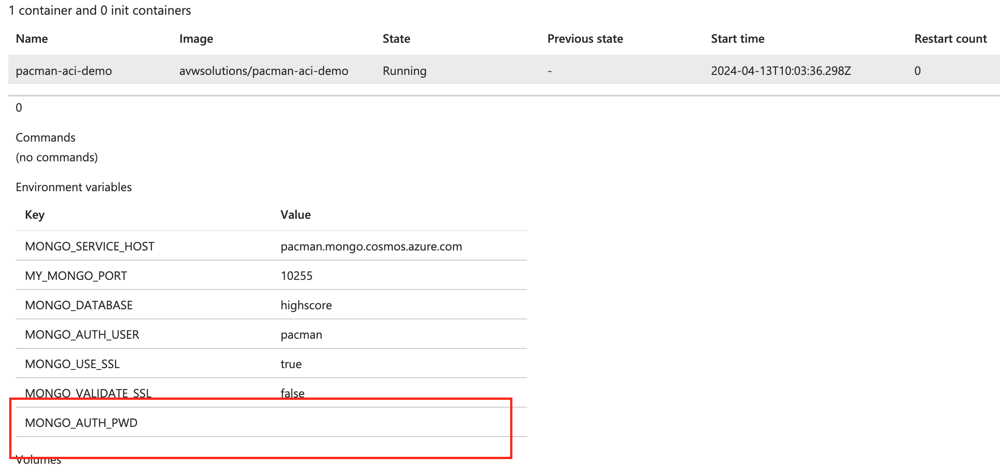
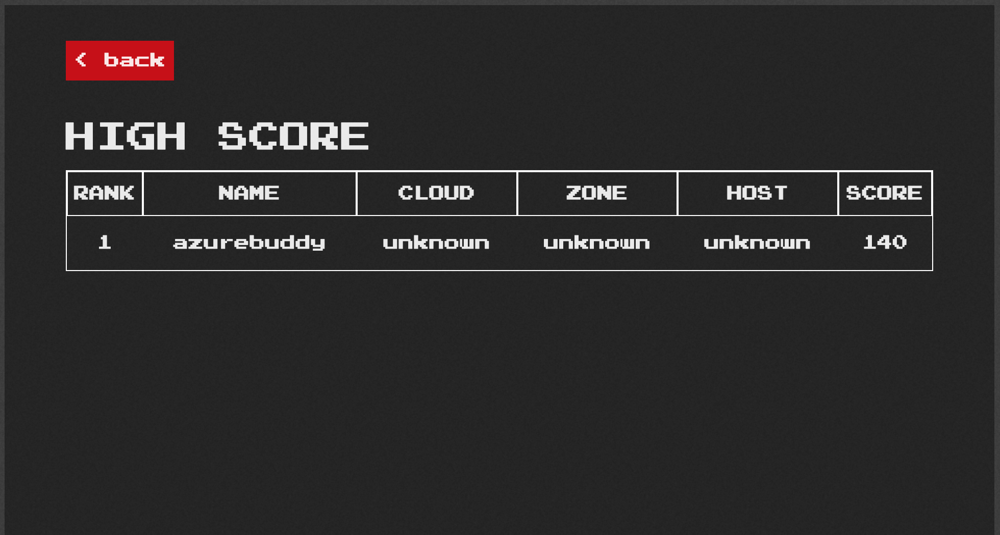

# Introduction

Easter is always fun with family time and telling stories. Yesterday I was explaining to my youngest about classic games I do like, better known as retro arcade games. They shine due their simplicity, no fancy graphics , just for fun! Who didn’t go to the arcade halls these old days, spending their last pennies.

To show them such a classic we watched the movie Pac-Man together. After this I got inspired to host my own Pac-Man game, play together and write this blog to share the tip and tricks how to set this up with Azure Container Instances (ACI) and Azure Cosmos DB (CDB).


Enjoy reading and you can always share your **high score** with `AzureBuddy` on Social Media like LinkedIn!



# Running container workloads with ACI

When multiple containers or dependencies are involved you may want to go for AKS, but running a simple `Node.JS` app you may want to look at Azure Container Instances, in short `ACI`. One of the biggest advantages is that you don't have to manage the container orchestration tool like with `AKS`. All management of the orchestration platform and underlying instances is done by the Azure team. Next to that you don't pay for the instance capacity, but solely for the resources the container image is consuming. In this use case a very good and easy fit for hosting my **Pac-Man** `Node.JS` app.

Let's start with our experiment!

For convenience I have created a repository with all the sample material during this blog. This repository contains my saved `ARM` templates and other reference material. We will use Bicep to deploy the services, but for this I have chosen to convert the `ARM` templates (aka JSON style) to Bicep syntax. 
This can be done using the following command.

```
 az bicep decompile --file template.json
```

This creates a **template.json** which we have to fix a minor thing to support *float* values. This can be fixed by replacing *'float(memory)'* for *'json(memory)'*.
More can be found on this [Github Issue 1386](https://github.com/Azure/bicep/issues/1386), which is the feature request for Bicep to natively support float values.

Adjust the **parameters.json** for your needs and we are ready to deploy our container.

```
az deployment group create --resource-group 'my-playground-sandbox' --template-file template_custom.bicep --parameters '@parameters.json'
```

Now let’s open the newly started service FQDN (found under Essentials) in a browser and open a session to port `8080`. You will see the actual game  Pac-Man loading ...



If you see this screen you now have  succesfully deployed the **Pac-Man** `Node.JS` app as ACI workload, but how is persistency arranged? Let's look further how to ensure our high scores are stored in a persistent way and don't get lost. To implement this we are going to use an Azure Cosmos DB. More specific we are going to look at *MongoDB* compatible engine. How to set up this service is described in the section below. 

You may already have seen errors in the container logs? If not, just try the command below to look for  *MongoDB connection failures*.

```
az container logs --resource-group my-playground-sandbox --name pacman-aci-demo
```

For now, start a new game to enjoy stateless Pac-Man.

# Running MongoDB databases using Cosmos DB

As may have noticed, the high scores are not saved yet, since there is no persistence in the backend. By inspecting the container logs we already learned about a required MongoDB for storing the game results. Exactly this is what are going to deploy to continue our experiment. Implementation specific we are going to use Azure Cosmos DB for MongoDB accounts, which we are going to consume the Request Units (RU) based approach.

First we are going to create a template again using the Azure portal and convert this using the `az bicep decompile` command.

As we have learned during the `ACI` deployment, a file **template.bicep** is created, which seems to work well, but notice the warnings that are displayed.

Adjust the **parameters.json** for your needs and we are ready to deploy our Azure Cosmos DB account. Ensure that to chose an unique name, since during writing of this article **Pac-Man** was not yet taken as account name.

```
az deployment group create --resource-group 'my-playground-sandbox' --template-file template_custom.bicep --parameters '@parameters.json'
```

After some minutes the newly created `Cosmos DB` account becomes available and we can start creating a *Cosmos DB Container*, which is the actual *Database*. Within that *Database* we create a new *Collection*, which actually holds the data collection in *MongoDB* where the documents are stored.

Here we have to keep in mind that *Cosmos DB* has *MongoDB compatibility*, but does have some specific requirements. 
More information can be found [here](https://learn.microsoft.com/en-us/azure/cosmos-db/mongodb/introduction). An example is that **Cosmos DB** requires the field a query requests a sort on to be indexed. If this is not the case, *sort* will fail with *error=2*. Read more about these common errors and solutions [here](https://learn.microsoft.com/en-us/azure/cosmos-db/mongodb/error-codes-solutions). That's why we are making use of a pre-defined index **idx.json**.

Below an example of such **idx.json** file

```
[
    {
        "key": {
            "keys": [
                "_id"
            ]
        },
        "options": null
    },
    {
        "key": {
            "keys": [
                "score"
            ]
        },
        "options": null
    }
]
```
Now it's time to get hands-on and create the actual *Database* and  *Collection* with the pre-defined index as shown above.

Creation of these resources can be easily done using the Azure portal or our preferred way using the command below. Ensure that the *idx.json* is stored in the current path, otherwise the execution will fail.

```
az cosmosdb mongodb collection create --account-name pacman --name highscore --database-name highscore --idx '@idx.json' --resource-group my-playground-sandbox
```

After approx 2 minutes the required resources are created and you may want to browse through the actual empty collection, which currently contains no stored *Documents*.


# Rollover the ACI Container workload with configured MongoDB connection settings

This section we will start with a recap of what we have completed so far.
- We have deployed the Pac-Man containerized app to ACI.
- We have deployed a CDB account and created a MongoDB Collection with a predefined index to store documents.
- For both deployments we have converted the ARM code to Bicep.

This brings us to the point that we have to reconfigure and rollover our ACI deployment with the required connection settings to properly store high scores in MongoDB Collection.

Since we already have deployed and set up CDB we can easily look up the connection information. This can be found in our newly created *pacman account*, under *’settings,  Connection strings’*. This connection information is required to properly set up the app credentials and connection information. Below the settings that we are looking for.

|   Setting  | Value |
| -------- | ------- |
| Host  | pacman.mongo.cosmos.azure.com  |
| Port  | 10255 |
| Database | highscore |
| Username | pacman |
| Password | MySecret |

With these settings we can start adjusting our `ACI` deployment. Let's start updating our current deployment and add additional parameters to the **parameters.json**. Challenge here is that we have to assign a secure value. Looking from a Security perspective this isn't the most preferred way, since we have to store our *MONGO_AUTH_PWD* in plain text. To overcome this challenge we can set an environment variable (using a *.env file*) when doing the deployment. Unfortunately JSON parameter files doesn't support this, so we are going to convert our `parameters_DB.json` to *Bicepparam* format.

First things first, we still have to update our current **template_custom.bicep** to reflect the new deployment. Things to add are:
- *@secure()* which is a decorator that ensures a secure object, our case *param environmentVariable0* as type *string*.
- Add all other six required variables, as example *param environmentVariable1* and don't forget to set the correct type *string*.
- After you have defined the Bicep *parameters*, you need to add the **nvironmentVariables* object, which includes all environment variables mapped to a Bicep parameter.

Now complete this *environmentVariables* object with the *Variable* names in the table below. *Values* are set later using the *parameters* file.

| Variable  | Value |
| -------- | ------- |
| MONGO_SERVICE_HOST  | pacman.mongo.cosmos.azure.com  |
| MY_MONGO_PORT  | 10255 |
| MONGO_DATABASE | highscore |
| MONGO_AUTH_USER | pacman |
| MONGO_AUTH_PWD | null |
| MONGO_USE_SSL | true |
| MONGO_VALIDATE_SSL | false |


No clue how to implement this? No problem at all.
Below an example code snippet to speed things up for extending your Bicep code with some additional parameters. 

Btw did you noticed the difference between *value* and *secureValue* ? Indeed that's why we included *secure()* to ensure string masking.

```
secure()
param environmentVariable0 string
param environmentVariable1 string

environmentVariables: [
  {
    name: 'MONGO_AUTH_PWD'
    secureValue: environmentVariable0
  }
  {
    name: 'MONGO_SERVICE_HOST'
    value: environmentVariable1
  }
]
```
As you may remember we didn't configured the *parameters* yet. We can start by updating our **parameters.json** file. For security reasons the actual **MONGO_AUTH_PWD** value is set to `null`. After adding the required adjustments we can convert it towards *bicepparam* for environment variable support.

Below an example snippet how to include the environment variables and store the changes in a new file called **parameters_DB.json**.

Adding all values be done using this code snippet.
```
"environmentVariable0": {
  "value": null 
},
"environmentVariable1": {
  "value": "pacman.mongo.cosmos.azure.com"
},
```

Great so far. Let's give the conversion of our **parameters_DB.json** a try. Keep in mind that only recent versions of the `Azure CLI` support *decompile-params* feature.

```
az bicep decompile-params --file parameters_DB.json
```

After running above command a new file called **parameters_DB.bicepparam** is created for us. Tadaa !!! The file is formatted in *bicepparam* format, but still requires some manual updates.

For example replace the *Using ''* to include your newly created bicep template with DB parameters set. See the example snippet below.

```
Using 'template_custom_DB.bicep'
```

Also we have to update our *environmentVariable0* to be read from an *Environment Variable* instead of a direct value. For this we can use the **readEnvironmentVariable* function.

```
param environmentVariable0 = readEnvironmentVariable('MONGO_AUTH_PWD')
```

If you adjusted the **parameters_DB.bicepparam** we can save the file. Now we are ready to rollover the current running container and start a new `ACI` deployment using native Bicep code. 

Btw don't forget to create your **.env** file. I have added an example file in the repository.

```
source .env
cd arm/deployment-template-aci
az deployment group create --resource-group 'my-playground-sandbox' --template-file template_custom_DB.bicep --parameters parameters_DB.bicepparam
```

After the deployment has succeeded we can validate if all the resources are available. We can either the Azure Portal or CLI. For now let's check the actual available resources through the CLI.

```
az resource list  --resource-group my-playground-sandbox --output=table
```
Now verify if the container has successfully pulled and started. Here I will show an Azure Portal snippet.



Awesome! if the container has been started we can also look if the configuration has been applied correctly and the *MONGO_AUTH_PWD* value is not visible. 



You will find a *hidden* value like shown above.

Ready to play your first *persistent* **Pac-Man** game?

Sstart a browser,  open a session again to port `8080` and start your first game. You might still remember where the FQDN can be found :)
When you got *Game Over* it's time to save the score.




Great. First you may want to verify the actual resources are created. We can first have a look into the actual container logs.

```
az container logs --resource-group my-playground-sandbox --name pacman-aci-demo
```


# Conclusion

If you are looking for an easy way of deploying containerized resources you may want to have a look at ACI. It provides a straightforward process and takes away the complexity of managing a full-blown Kubernetes environment. Afaik there are some limitations, but these are mainly related when you are requiring more advanced features such as networking or development integration you may be better off with AKS. During our experiment we still found some limitations, such as pulling container images directly from *quay.io*.  This resulted in container *Waiting* state. 

Hopefully you liked this Tip & tricks how to article, which explains the basics of getting up & running with Azure Container Instances and Azure Cosmos DB. Now it’s time to host and play your own retro arcade game Pac-Man! 

# Interested in the code?

All code samples, including local scripts is available at [Azure Buddy Github](https://github.com/azure-buddy/intro-pacman-aci-cosmosdb).

Contributions or follow-up articles are more than appreciated!