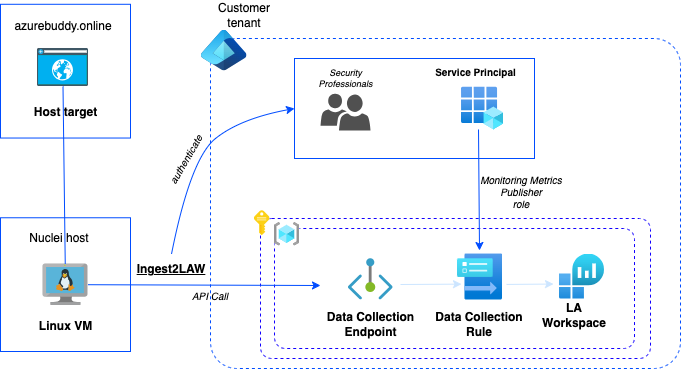
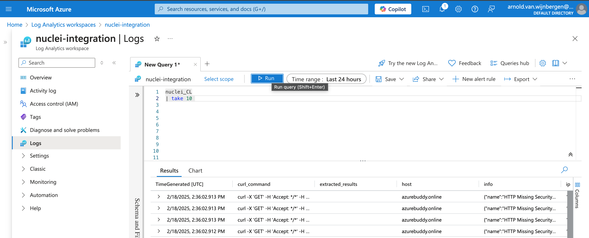

## Introduction

This blog post I’m going to look into Nuclei. Nuclei is one of the popular tools used by Penetration Testers. Pentesting in-short is important because it helps identify security vulnerabilities before attackers can exploit them. It simulates real-world cyberattacks that help to assess and get an understanding of the effectiveness of defenses, validates your system hardening, reduces the risk of data breaches, and ensures compliance with security standards. All these activities like vulnerability scans and configuration reviews can be automated using this multifunctional called Nuclei.


Enjoy reading and you can always share your **ideas** with `AzureBuddy` on Social Media like LinkedIn!


## What is Nuclei?

Nuclei is an *Open Source CLI-based tool* to perform those *vulnerability scans* against targets like network resources. It *leverages YAML* based *templates* to add further capabilities to the Nuclei engine. Nuclei templates as they are called, contain information, execution flows and the actual execution code. We will have a look into some Azure specific *Nuclei templates*, used for *configuration review* and how they are executed. After getting a basic understanding of the **foundational concepts** using templates, I will guide you through some **hands-on examples**.


Credits to [Project Discovery](https://github.com/projectdiscovery) for developing such powerful `Nuclei` CLI Tool.


## Quickly getting started

### Get familiar with the Network Vulnerability Scanning capabilities

Let's first start using Nuclei as a simple *network vulnerability scanner* against a *single web host*, such as your own website. This is the easiest way to get familiar with `Nuclei` as Pentesting tool. In more real-life scenarios you may use a target list '*-l file*', which can even contain *multiple targets* to scan.

Example below shows how you can execute a scan against **Azure Buddy Online**, which is actually a *Hugo-based* static website hosted on **Github**.

```
nuclei -u https://azurebuddy.online
```

After some minutes the following output is returned:

```
[INF] Current nuclei version: v3.3.8 (latest)
[INF] Current nuclei-templates version: v10.1.2 (latest)
[WRN] Scan results upload to cloud is disabled.
[INF] New templates added in latest release: 52
[INF] Templates loaded for current scan: 7656
[WRN] Loading 380 unsigned templates for scan. Use with caution.
[INF] Executing 7276 signed templates from projectdiscovery/nuclei-templates
[INF] Targets loaded for current scan: 1
[INF] Templates clustered: 1698 (Reduced 1598 Requests)
[INF] Using Interactsh Server: oast.me
[missing-sri] [http] [info] https://azurebuddy.online ["https://github.github.com/pages-staticassets/primer-tiny.css"]
[waf-detect:varnish] [http] [info] https://azurebuddy.online
[http-missing-security-headers:x-frame-options] [http] [info] https://azurebuddy.online
[http-missing-security-headers:x-permitted-cross-domain-policies] [http] [info] https://azurebuddy.online
[http-missing-security-headers:referrer-policy] [http] [info] https://azurebuddy.online
[http-missing-security-headers:cross-origin-embedder-policy] [http] [info] https://azurebuddy.online
[http-missing-security-headers:cross-origin-opener-policy] [http] [info] https://azurebuddy.online
[http-missing-security-headers:strict-transport-security] [http] [info] https://azurebuddy.online
[http-missing-security-headers:content-security-policy] [http] [info] https://azurebuddy.online
[http-missing-security-headers:clear-site-data] [http] [info] https://azurebuddy.online
[http-missing-security-headers:cross-origin-resource-policy] [http] [info] https://azurebuddy.online
[http-missing-security-headers:permissions-policy] [http] [info] https://azurebuddy.online
[http-missing-security-headers:x-content-type-options] [http] [info] https://azurebuddy.online
[tls-version] [ssl] [info] azurebuddy.online:443 ["tls12"]
[tls-version] [ssl] [info] azurebuddy.online:443 ["tls13"]
[ssl-issuer] [ssl] [info] azurebuddy.online:443 ["Let's Encrypt"]
[ssl-dns-names] [ssl] [info] azurebuddy.online:443 ["www.azurebuddy.online","azurebuddy.online"]
[rdap-whois:registrationDate] [http] [info] https://rdap.centralnic.com/online/domain/azurebuddy.online ["2024-02-01T20:32:07.0Z"]
[rdap-whois:lastChangeDate] [http] [info] https://rdap.centralnic.com/online/domain/azurebuddy.online ["2025-02-02T00:15:31.0Z"]
[rdap-whois:expirationDate] [http] [info] https://rdap.centralnic.com/online/domain/azurebuddy.online ["2026-02-01T23:59:59.0Z"]
[rdap-whois:registrantName] [http] [info] https://rdap.centralnic.com/online/domain/azurebuddy.online [""]
[rdap-whois:registrantCountry] [http] [info] https://rdap.centralnic.com/online/domain/azurebuddy.online [""]
[rdap-whois:nameServers] [http] [info] https://rdap.centralnic.com/online/domain/azurebuddy.online ["ns.zxcs.nl","ns.zxcs.be","ns.zxcs.eu"]
[rdap-whois:secureDNS] [http] [info] https://rdap.centralnic.com/online/domain/azurebuddy.online ["false"]
[rdap-whois:status] [http] [info] https://rdap.centralnic.com/online/domain/azurebuddy.online ["client transfer prohibited","auto renew period"]
```

You may recognize several templates are executed. Let's now look further into those **Nuclei Templates**.

### Understanding Nuclei Templates

Nuclei templates are the way to extend Nuclei with new functionality. Many great *Nuclei templates* exist, built by the community and vary in functionality. We are going to have a look into a specific Azure Nuclei template, which is used to validate the *Azure Cloud Environment connection*. Later during this blog you are going to develop your own Azure *Nuclei template* which provides a configuration review for validating if *Public Network Access* is enabled for *Azure Monitoring LAWs*.  If this condition is `true` a *warning* message will be logged.

So let's first starting looking into the actual **azure-env** Nuclei template below:

```
id: azure-env
info:
  name: Azure Environment Validation
  author: princechaddha
  severity: info
  description: |
    Checks if Azure CLI is set up and all necessary tools are installed on the environment.
  reference:
    - https://portal.azure.com/
  metadata:
    max-request: 2
  tags: cloud,devops,microsoft,azure,azure-cloud-config

self-contained: true
code:
  - engine:
      - sh
      - bash
    source: |
      az account show

    matchers:
      - type: word
        words:
          - '"homeTenantId":'

    extractors:
      - type: json
        name: environmentname
        json:
          - '.environmentName'
        internal: true

      - type: dsl
        dsl:
          - '"Azure CLI is properly configured for environment \"" + environmentname + "\"."'
# digest: 490a0046304402207bf332a0f7de6876768c2772dcac7c909873dd60a265c517ee8927b9c62f652902200f13766da38ea080f0bc1efadf056b760b3fe1b654e6244ac8a811f508471bc0:922c64590222798bb761d5b6d8e72950
```
The **YAML** file contains *id*, *info Array*, *flow Array* and the actual *code Array* to execute and report results. An important *Variable* that is set here is *self-contained*, this actually means that it's a *stand-alone template* that does not require any user input, such as a target or URL. Instead it requires you to have a *valid logged-in Azure CLI* available. Something to keep in mind during this blog, that actually the *Azure CLI* is a dependency here.

You may also notice that the last line a *digest* has been set. This *digest* is actually the signature of the *Nuclei template*. New templates always have to be signed, before you can execute them. Actually *azure-env* is a *core* template which has already been signed, so we can safely execute this to verify our connection.

Let's now get ready to execute this piece of code to validate that your *Azure CLI* connection is properly set and you are ready to successfully execute the **Configuration scans** against **Microsoft Azure**.

```
nuclei -id azure-env -code
```

The following will be show when the **Azure CLI** is successfully logged in using `az login`.

```
                     __     _
   ____  __  _______/ /__  (_)
  / __ \/ / / / ___/ / _ \/ /
 / / / / /_/ / /__/ /  __/ /
/_/ /_/\__,_/\___/_/\___/_/   v3.3.8

		projectdiscovery.io

[INF] Current nuclei version: v3.3.8 (latest)
[INF] Current nuclei-templates version: v10.1.2 (latest)
[WRN] Scan results upload to cloud is disabled.
[INF] New templates added in latest release: 52
[INF] Templates loaded for current scan: 1
[INF] Executing 1 signed templates from projectdiscovery/nuclei-templates
[azure-env] [code] [info]  ["Azure CLI is properly configured for environment "AzureCloud"."]
```

Now that you know more about working with *Nuclei Templates*, we can start exploring all *Community Templates* that already are available for you!.

## Work with Community-Powered Azure Nuclei Templates

### Azure Cloud Config Review

Nuclei ships with a lot of templates. *Nuclei Templates* differ from Cloud, DAST, CVE Checks and Operating System Audits. A lot to mention, just take a quick look at the [Nuclei Templates repository](https://github.com/projectdiscovery/nuclei-templates/tree/main), which is hosted on GitHub.

Our focus during this blog is **Azure Cloud**, so we will dive further into the *Azure Cloud Config Review* capabilities. A rich set of *Nuclei Templates* that is already available for us.

You can start a full *Config Review* by executing a *predefined scanning profile* called *azure-cloud-config*. 


Extra attention is needed, since executing this profile requires you to have enough system resources to process and can be a little bit too much, so don't run this on Production environments.


To maximize the number of *Nuclei Templates* that are executed, you may want to include *code execution* and *self-contained script* parameters.

```
 azure-cloud-config [-code] [-esc]
```

Next chapter we will dive into a subset of *Azure Config Review* templates. These can be easily executed, help to catch configuration mistakes and give you more insights about what Nuclei provides for pentesting **Azure Cloud**.

### Azure Cloud Community Templates for AKS Config Review

We will now look at a specific collection of **Nuclei Templates** for **Azure Kubernetes Services**. To execute all templates we can easily provide the tag '*aks*'. Again we don't want to forget to include the *code* and *esc* parameters. 

For the sake of this demo, I've deployed a badly configured `AKS` cluster.

```
nuclei -tags aks -code -esc
```

The scan completes after approx. a minute and returns the following output with five (5) findings.

```
[INF] Current nuclei version: v3.3.8 (latest)
[INF] Current nuclei-templates version: v10.1.2 (latest)
[WRN] Scan results upload to cloud is disabled.
[INF] New templates added in latest release: 52
[INF] Templates loaded for current scan: 8
[INF] Executing 8 signed templates from projectdiscovery/nuclei-templates
[azure-aks-api-unrestricted] [code] [high]  ["sandbox in azure-buddy-playground-sandbox does not have authorized IP ranges configured for AKS API server access"]
[azure-aks-cni-not-configured] [code] [medium]  ["sandbox in azure-buddy-playground-sandbox is using Kubenet instead of Azure CNI"]
[azure-aks-not-user-assigned] [code] [high]  ["sandbox in resource group 1azure-buddy-playground-sandbox does not use user-assigned managed identities"]
[azure-aks-entra-id-unintegrated] [code] [high]  ["sandbox in azure-buddy-playground-sandbox does not have Microsoft Entra ID integration configured"]
[azure-aks-network-contrib-unassigned] [code] [medium]  ["sandbox in resource group azure-buddy-playground-sandbox does not have Network Contributor role assigned"]
```

You can even include scanning **cluster objects** by have a configured `kubectl` available. Great isn't it?

Now it's time to start developing your own *Nuclei Template*.

### Developing your own Nuclei Template for Azure Monitor

Some cases a template isn't yet available.These situations you can easily develop and create your own. Below the **Nuclei Template** which was recently mentioned in the previous chapter about *Nuclei Templates*. The goal of this specific template is to provide a configuration review for validating if Public Network Acces is enabled for one or more discovered *Azure Monitoring LAW*. If this condition is `true` a warning message is logged.

Did you recognize sections like *info*, *flow* and *code*? Writing templates isn't hard if you are familiar with PowerShell, Python or have *basic* coding skills.

As Id we have set **azure-monitor-law-public-network-acces-enabled**.  

Below the actual code. The *Nuclei Template* can be saved under filename: `azure-monitor-law-public-network-acces-enabled.yaml`.

```
id: azure-monitor-law-public-network-acces-enabled
info:
  name: Azure Log Analytics Workspace Public Network Acces Enabled
  author: avwsolutions
  severity: medium
  description: |
    Ensure that public network access is disabled for Log Analytics Workspaces (LAWs) in order to protect against persistent and advanced attacks against unauthorized data access.
  impact: |
    Not disabling public access for log anaytics workspaces can leave them susceptible to advanced persistent threats and compromise the network integrity and security of your Log Analytics APIs.
  remediation: |
    Disable public network access for Log Analytics Workspaces (LAWs) and only make it accessible for Azure Private Link configured resources.
  reference:
    - https://learn.microsoft.com/en-us/azure/azure-monitor/logs
  tags: cloud,devops,azure,microsoft,monitor,log-analytics,azure-cloud-config

flow: |
  code(1);
  for (let LawData of iterate(template.lawList)) {
    set("ids", LawData);
    code(2);
  }

self-contained: true
code:
  - engine:
      - sh
      - bash
    source: |
      az monitor log-analytics workspace list --query '[*].id'

    extractors:
      - type: json
        name: lawList
        internal: true
        json:
          - '.[]'

  - engine:
      - sh
      - bash
    source: |
      az monitor log-analytics workspace show --ids "$ids" --query '{"publicNetworkAccessForIngestion": publicNetworkAccessForIngestion, "publicNetworkAccessForQuery": publicNetworkAccessForQuery}'

    matchers-condition: and
    matchers:
      - type: word
        words:
          - '"publicNetworkAccessForIngestion": "Enabled"'
          - '"publicNetworkAccessForQuery": "Enabled"'

    extractors:
      - type: dsl
        dsl:
          - 'ids + " does have Public Network Access enabled"'

```

Also keep in mind we didn'te yet signed the template. Below the full nuclei command that does the initial signing. You may want to increase *Debug* logging.

```
nuclei -t azure-monitor-law-public-network-acces-enabled.yaml -esc -code --debug -sign
```

The following output is returned. You may recognize a new comment line called *Digest* has been added, which contains the signature.

```
[INF] All templates signatures were elaborated success=1 failed=0
```

Now we are ready to execute this newly developed template. We will now directly point to the actual template file using the '-t' flag. You may want to include *Debug* logging.

```
nuclei -t azure-monitor-law-public-network-acces-enabled.yaml -esc -code [-debug]
```

The following ourput is shown within a minute. 

```
                     __     _
   ____  __  _______/ /__  (_)
  / __ \/ / / / ___/ / _ \/ /
 / / / / /_/ / /__/ /  __/ /
/_/ /_/\__,_/\___/_/\___/_/   v3.3.8

		projectdiscovery.io

[INF] Current nuclei version: v3.3.8 (latest)
[INF] Current nuclei-templates version: v10.1.2 (latest)
[WRN] Scan results upload to cloud is disabled.
[INF] New templates added in latest release: 52
[INF] Templates loaded for current scan: 1
[INF] Executing 1 signed templates from avwsolutions
[azure-monitor-law-public-network-acces-enabled] [code] [medium]  ["/subscriptions/80ea444e8-afce-4851-928a-9e2219724c69/resourceGroups/azure-buddyplayground-sandbox/providers/Microsoft.OperationalInsights/workspaces/sandbox does have Public Network Access enabled"]
```

Hopefully this shows how easily you can extend functionality for `nuclei` and make your own *custom scans*. Let's dive into the last chapter, which makes our *Ninja training for Azure pentesting* complete. Here we will use a small tool I've developed to send your scan results directly into a *Kusto Table*.

## Storing Nuclei results into a Kusto table

You have reached the last part of the blog. This chapter we are going to store our `Nuclei` scan results into a *Kusto Table*, so you can combine it with other important datasets from Microsoft Defender (XDR) or Microsoft Sentinel (SIEM/SOAR). Storing your scan results can help you as *Security Engineer* or *Security Analysts* to further analyze, report and visualize by using *Kusto Query Language* over time. Another use case would be period endpoints scans and storing *historical data* for audit trail. These are just two simple examples. 

Let's start to setup `Ingest2LAW`. It's a simple tool, created with Python using official **PyPI** Microsoft packages to ingest Azure Monitor data.

During the following subchapters I'm going to explain how to setup the required infrastructure, followed by some real examples shoing scan results entering your newly created tables. Let's get started.

### Required Azure Infrastructure Setup

To deploy the required *Azure Infrastructure* I've created some supporting *Bicep* code, but first look into the *architecture*.

The following Azure resources are going to be deployment:
- Log Analytics Workspace (LAW), including a custom *Kusto table* for storing the actual *JSON* formatted reports.
- Azure Monitor Data Collection Rule (DCR) that handles the data flow, additional parsing/transformation and underlying schema storing the data into the *Kusto table*.
- Azure Monitor Data Collection Endpoint (DCE) that actually is the receiving endpoint, which is used by the tool called `Ingest2LAW` and forwards towards the newly setup DCR.
- Authentication of publishing data from the DCR into the LAW we are going to use a Service Principal (SPN), which you have to create first in Entra ID. An addtional PowerShell script for this is included.

Below a picture of the architecture:


### Solution approach to deploy Azure Resources

Now that you know the solution approach we can start cloning the actual repository. I do expect you are familiar with the basics of using `Git` CLI.

```
git clone https://github.com/avwsolutions/nuclei-kusto-db-integration.git
```

#### Create your required Entra ID Service Principal Name.

Let's first create Service Principal. Additional ensure that you are logged in the **Azure CLI**.  For convinience I've added a PowerShell script to create the object. Look into the script and execute the following command.

```
pwsh ./deployment/entra/createSPN.ps1
```

The following are the most important parts that are returned.

```
AccountEnabled                     : True
...
AppDisplayName                     : nuclei-security-scanner
...
Id                                 : 84770ec3-9f80-47d3-b5e8-a92b319910ff
PasswordCredentials                : < save this block as Secret note for later >
```

Ensure that you write down the **Object ID** and **Password Credentials** because you need it later configuring the actual deployment.

#### Deploy required Azure resources using Bicep

Now take a look at the *deployment/azure* folder and parameterize the `params.json` for your needs. Most important here is the **Object ID*8 from your newly created SPN.

```
{
  "$schema": "https://schema.management.azure.com/schemas/2019-04-01/deploymentParameters.json#",
  "contentVersion": "1.0.0.0",
  "parameters": {
    "appName": {
      "value": "nuclei"
    },
    "environment": {
      "value": "sandbox"
    },
    "location": {
      "value": "eastus"
    },
    "servicepPrincipalObjectId": {
      "value": "<put your Object ID here>"
    }
  }
}
```

Now let's start the actual deployment. In my scenario I already have created a *Azure Resource Group* called *nuclei-sandbox*.

```
az deployment group create --resource-group 'nuclei-sandbox' --template-file deployment/azure/solution.bicep --parameters '@deployment/azure/params.json'
```

Are some minutes everything the actual *Azure Resource* creation is finished. It will return a *JSON* output.

#### Installing the Ingest2LAW App on a Linux VM

Now we are at the moment we can install the *App* locally ('/usr/local/bin`), ensure dependencies are set and include it in our *runtime environment* (privilege escalation required!).

Start by cloning the actual repository and run the `install.sh` script. Ensure you have both the Python 3.x and Pip packages installed.

```
git clone https://github.com/avwsolutions/nuclei-kusto-db-integration.git

cd app
./install.sh
```

### Start ingesting scan results in your Log Analytics Workspace

Almost everything is ready to ingest your scan results. Only thing that you need are some *System Variables* to be set. These are required by the used *Microsoft Python packages*.  Personally I always create a *.env* file. I've included an example called `example-env`. 

Complete the following example and save the file as `.env`. Take notice it does include a *personal secret*, so set appropiate permissions and handle with care. 

```
export LOGS_DCR_RULE_ID=dcr-xxxxxxxxxxxxxxxxx
export LOGS_DCR_STREAM_NAME=Custom-nuclei_CL
export DATA_COLLECTION_ENDPOINT=https://nuclei-ingest-endpoint-eeee.eastus-1.ingest.monitor.azure.com
export AZURE_TENANT_ID=
export AZURE_CLIENT_ID=
export AZURE_CLIENT_SECRET=
```

You can now load the *System Variables* and store your first scan results. We advice to always add the '*-silent*' and '*-j*' (JSON Output) options, everything else you already familiar with.

```
. .env
nuclei -silent -u https://azurebuddy.online -j | ingest2LAW
```

After  +/- 5 minutes you will see records being created in the *nuclei_CL* table. 

### Play with Scan Results using Kusto Query Language (KQL)

Let's now try some other KQL queries to play with the scan results. To build and execute the `KQL` queries we are going to use the `Azure Portal`. Now open your newly created `LAW` and start with a simple query to get ten records using `take 10`.



In the following example queries we assume that you have used *azurebuddy.online* as scan target. Other cases, just update the *host ==* part.

**Display only the HTTP type related records within the last 30 minutes from my current scan target.**
```
nuclei_CL
| where host == 'azurebuddy.online' and nuclei_type == 'http' and TimeGenerated > ago(30m)
```

**Display all other types related records except HTTP within the last 30 minutes from my current scan target.**
```
nuclei_CL
| where host == 'azurebuddy.online' and nuclei_type != 'http' and TimeGenerated > ago(30m)
```

**Summarize the total numeber of checks of every type within the last 30 minutes ordered by Total number count.**
```
nuclei_CL
| where host == 'azurebuddy.online' and TimeGenerated > ago(30m)
| summarize Total_checks = count() by nuclei_type
| order by Total_checks desc
```

**Display the records of SSL checks that report the use of older TLS Versions.**
```
nuclei_CL
| where host == 'azurebuddy.online' and nuclei_type == 'ssl' and info contains "TLS Version" and
 extracted_results !contains 'tls13' and TimeGenerated > ago(30m)
```

**Display the record if any WAF is detected.**
```
nuclei_CL
| where host == 'azurebuddy.online' and nuclei_type == 'http' and
 template_id == 'waf-detect' and TimeGenerated > ago(30m)
| project info
```

As you may suspect you aren't limited to storing *network target* scans.

For example storing the [AKS Code Review](#azure-cloud-community-templates-for-aks-config-review) results in youru `LAW` for analysis.

```
nuclei -silent -tags aks -code -esc -j | ingest2LAW
```

After a successfull scan you can review the newly added records using this **KQL**.

```
nuclei_CL
| where template_id contains 'azure-aks' and TimeGenerated > ago(30m)
| project extracted_results
```

Now let's format a table of the actual *scan results* using **KQL**.

```
nuclei_CL
| where template_id contains 'azure-aks' and TimeGenerated > ago(30m)
| extend ScanInfo = parse_json(info)
| project Name = ScanInfo.name, Description = ScanInfo.description, Impact = ScanInfo.impact, Severity = ScanInfo.severity, Reference = ScanInfo.reference, Remediation = ScanInfo.remediation
```

We can repeat this exercise for our own developed template. 

```
nuclei -silent -t azure-monitor-law-public-network-acces-enabled.yaml -esc -code -j | ingest2LAW
```

Now run a **KQL** to only get our specific *Nuclei Template* results. Here I'm filtering on *author*.

```
nuclei_CL
| where info contains 'avwsolutions' and TimeGenerated > ago(365d)
| extend ScanInfo = parse_json(info)
| project Name = ScanInfo.name, Description = ScanInfo.description, Impact = ScanInfo.impact, Severity = ScanInfo.severity, Reference = ScanInfo.reference, Remediation = ScanInfo.remediation
```

## Conclusion

Going through this blog, working with *Nuclei* gives us a good understanding of the *value* it provides during *penetration testing*. It's can support both *Security Engineers* and *Security Analysts* to include these *data sets* for further analysis. Besides the *powerful* scan engine and simplicity adding new functionality you can easily *integrate* scan results with your *Microsoft Security Toolsl* using a `LAW`.

# Interested in the code?

All code samples, including local scripts is available at [Azure Buddy Github](https://github.com/azure-buddy/nuclei-kusto-db-integration).

Contributions or follow-up articles are more than appreciated!